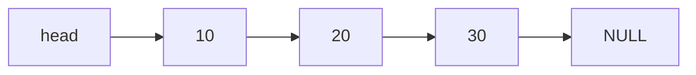

# Catalog học Data Structures bằng C

> Mục tiêu: học Data Structures không chỉ để biết lý thuyết, mà để hiểu **memory**, **pointer**, **malloc/free**, **algorithmic complexity**, và cách các cấu trúc dữ liệu được dùng trong backend/system/OS.

---

## Cách dùng catalog này

- [ ] Đọc concept
- [ ] Vẽ diagram bằng tay hoặc Mermaid
- [ ] Implement bằng C
- [ ] Viết test case
- [ ] Debug bằng `printf` hoặc debugger
- [ ] Tự giải thích lại bằng lời của mình
- [ ] Làm mini project nhỏ

Gợi ý: mỗi topic nên có một folder riêng.

```text
data-structures-c/
├── 01-array/
├── 02-dynamic-array/
├── 03-linked-list/
├── 04-stack/
├── 05-queue/
├── 06-hash-table/
├── 07-tree/
├── 08-heap/
├── 09-trie/
└── 10-graph/
```

---

# Phase 0 — Nền tảng C cần chắc trước

## 0.1 Pointer

### Cần hiểu

- [ ] Biến thường và địa chỉ
- [ ] `&` là lấy địa chỉ
- [ ] `*` là dereference
- [ ] Pointer trỏ tới biến
- [ ] Pointer trỏ tới struct
- [ ] Null pointer
- [ ] Pointer arithmetic cơ bản

### Bài tập

- [ ] In giá trị và địa chỉ của một biến `int`
- [ ] Viết hàm swap bằng pointer
- [ ] Dùng pointer để duyệt array
- [ ] Tạo struct và truy cập bằng `->`

---

## 0.2 Struct

### Cần hiểu

- [ ] Struct là gì
- [ ] Struct chứa nhiều field
- [ ] Struct có thể chứa pointer tới struct cùng loại
- [ ] `.` vs `->`

### Ví dụ

```c
typedef struct Node {
    int data;
    struct Node *next;
} Node;
```

### Bài tập

- [ ] Tạo struct `Student`
- [ ] Tạo struct `Point`
- [ ] Tạo struct `Node`
- [ ] Viết hàm in thông tin struct

---

## 0.3 Dynamic Memory

### Cần hiểu

- [ ] Stack memory
- [ ] Heap memory
- [ ] `malloc`
- [ ] `calloc`
- [ ] `realloc`
- [ ] `free`
- [ ] Memory leak
- [ ] Dangling pointer

### Bài tập

- [ ] Cấp phát một biến `int` bằng `malloc`
- [ ] Cấp phát array động
- [ ] Resize array bằng `realloc`
- [ ] Free đúng cách
- [ ] Test bằng Valgrind hoặc AddressSanitizer

---

# Phase 1 — Linear Data Structures

---

## 1. Array

### Mục tiêu

Hiểu dữ liệu nằm liên tiếp trong memory và truy cập bằng index.

### Cần hiểu

- [ ] Array tĩnh
- [ ] Index
- [ ] Memory liên tiếp
- [ ] Truy cập `O(1)`
- [ ] Insert/delete giữa array là `O(n)`
- [ ] Array decay thành pointer khi truyền vào function

### Operations cần implement

- [ ] Print array
- [ ] Search value
- [ ] Insert at index
- [ ] Delete at index
- [ ] Reverse array
- [ ] Find max/min
- [ ] Count frequency

### Mini project

- [ ] Viết chương trình quản lý danh sách điểm số bằng array
- [ ] Tìm điểm cao nhất/thấp nhất/trung bình
- [ ] Xóa điểm tại vị trí bất kỳ
- [ ] Chèn điểm mới vào vị trí bất kỳ

### Khi nào dùng?

- Cần truy cập nhanh bằng index
- Dữ liệu có kích thước biết trước
- Cần iterate nhanh, cache-friendly

---

## 2. Dynamic Array

### Mục tiêu

Hiểu cách `ArrayList` hoặc `vector` hoạt động bên trong.

### Cần hiểu

- [ ] `size`
- [ ] `capacity`
- [ ] Resize khi đầy
- [ ] `realloc`
- [ ] Amortized `O(1)` cho append
- [ ] Khác biệt giữa size và capacity

### Struct gợi ý

```c
typedef struct DynamicArray {
    int *data;
    int size;
    int capacity;
} DynamicArray;
```

### Operations cần implement

- [ ] Init dynamic array
- [ ] Append
- [ ] Insert at index
- [ ] Delete at index
- [ ] Get by index
- [ ] Set by index
- [ ] Resize capacity
- [ ] Free array

### Mini project

- [ ] Tự implement `ArrayList<int>` bằng C
- [ ] Cho phép thêm/xóa/sửa/in danh sách
- [ ] Khi đầy thì capacity nhân đôi

### Khi nào dùng?

- Không biết trước số lượng phần tử
- Vẫn cần truy cập nhanh bằng index
- Dữ liệu thường thêm ở cuối

---

## 3. Singly Linked List

### Mục tiêu

Hiểu node, pointer, `next`, và cách nối/ngắt node trong memory.

### Cần hiểu

- [ ] Node là gì
- [ ] `head` là gì
- [ ] `next` chứa địa chỉ node tiếp theo
- [ ] Node cuối có `next = NULL`
- [ ] Insert/delete bằng cách sửa pointer
- [ ] Không truy cập nhanh bằng index

### Struct gợi ý

```c
typedef struct Node {
    int data;
    struct Node *next;
} Node;
```

### Operations cần implement

- [ ] Create node
- [ ] Append tail
- [ ] Insert head
- [ ] Insert after node
- [ ] Insert at index
- [ ] Delete head
- [ ] Delete tail
- [ ] Delete by value
- [ ] Search
- [ ] Print list
- [ ] Count length
- [ ] Reverse list
- [ ] Free entire list

### Mermaid cần tự vẽ



### Mini project

- [ ] Quản lý playlist đơn giản
- [ ] Thêm bài hát vào cuối
- [ ] Chèn bài hát sau bài hát bất kỳ
- [ ] Xóa bài hát theo tên
- [ ] In playlist

### Khi nào dùng?

- Cần insert/delete linh hoạt
- Không cần truy cập bằng index nhanh
- Muốn hiểu pointer và dynamic memory thật sâu

---

## 4. Doubly Linked List

### Mục tiêu

Hiểu linked list hai chiều với `prev` và `next`.

### Cần hiểu

- [ ] Mỗi node có `prev`
- [ ] Mỗi node có `next`
- [ ] Duyệt tiến/lùi
- [ ] Insert/delete cần sửa nhiều pointer hơn singly linked list
- [ ] Tốn thêm memory cho `prev`

### Struct gợi ý

```c
typedef struct DNode {
    int data;
    struct DNode *prev;
    struct DNode *next;
} DNode;
```

### Operations cần implement

- [ ] Insert head
- [ ] Append tail
- [ ] Insert before node
- [ ] Insert after node
- [ ] Delete node
- [ ] Print forward
- [ ] Print backward
- [ ] Free list

### Mini project

- [ ] Undo/Redo system đơn giản
- [ ] Mỗi action là một node
- [ ] Undo đi về `prev`
- [ ] Redo đi tới `next`

### Khi nào dùng?

- Cần đi hai chiều
- Cần xóa node nhanh khi đã có pointer tới node đó
- LRU cache
- Undo/Redo
- Browser history

---

## 5. Circular Linked List

### Mục tiêu

Hiểu list mà node cuối trỏ về node đầu.

### Cần hiểu

- [ ] Không có `NULL` ở cuối
- [ ] Tail trỏ về head
- [ ] Cẩn thận vòng lặp vô hạn
- [ ] Dùng tốt cho round-robin

### Operations cần implement

- [ ] Insert head
- [ ] Append tail
- [ ] Delete node
- [ ] Traverse một vòng
- [ ] Free list

### Mini project

- [ ] Round-robin scheduler đơn giản
- [ ] Danh sách process chạy vòng tròn

### Khi nào dùng?

- Round-robin scheduling
- Game turn system
- Circular playlist

---

# Phase 2 — Abstract Data Types

---

## 6. Stack

### Mục tiêu

Hiểu cấu trúc LIFO: Last In, First Out.

### Cần hiểu

- [ ] Push
- [ ] Pop
- [ ] Peek/top
- [ ] Is empty
- [ ] Stack overflow nếu dùng array tĩnh
- [ ] Có thể implement bằng array hoặc linked list

### Operations cần implement

- [ ] Init stack
- [ ] Push
- [ ] Pop
- [ ] Peek
- [ ] Is empty
- [ ] Free stack

### Mini project

- [ ] Kiểm tra ngoặc hợp lệ
- [ ] Reverse string bằng stack
- [ ] Convert decimal sang binary bằng stack

### Ứng dụng

- Function call stack
- Undo
- DFS
- Backtracking
- Expression parsing

---

## 7. Queue

### Mục tiêu

Hiểu cấu trúc FIFO: First In, First Out.

### Cần hiểu

- [ ] Enqueue
- [ ] Dequeue
- [ ] Front
- [ ] Rear
- [ ] Simple queue
- [ ] Circular queue
- [ ] Queue bằng linked list

### Operations cần implement

- [ ] Init queue
- [ ] Enqueue
- [ ] Dequeue
- [ ] Peek front
- [ ] Is empty
- [ ] Free queue

### Mini project

- [ ] Print queue
- [ ] Task queue
- [ ] Mô phỏng hàng đợi khách hàng
- [ ] BFS sau này sẽ dùng queue

### Ứng dụng

- Request queue
- Job queue
- Message queue
- Print queue
- Scheduler
- BFS

---

## 8. Deque

### Mục tiêu

Hiểu queue hai đầu: thêm/xóa được ở cả đầu và cuối.

### Cần hiểu

- [ ] Push front
- [ ] Push back
- [ ] Pop front
- [ ] Pop back
- [ ] Có thể dùng doubly linked list

### Operations cần implement

- [ ] Insert front
- [ ] Insert back
- [ ] Delete front
- [ ] Delete back
- [ ] Peek front
- [ ] Peek back

### Mini project

- [ ] Browser history đơn giản
- [ ] Sliding window maximum nâng cao

---

# Phase 3 — Hashing

---

## 9. Hash Table

### Mục tiêu

Hiểu cách `HashMap` hoạt động bên trong.

### Cần hiểu

- [ ] Key-value
- [ ] Hash function
- [ ] Bucket
- [ ] Collision
- [ ] Chaining
- [ ] Open addressing
- [ ] Load factor
- [ ] Resize/Rehash

### Struct gợi ý chaining

```c
typedef struct Entry {
    char *key;
    int value;
    struct Entry *next;
} Entry;

typedef struct HashTable {
    Entry **buckets;
    int capacity;
    int size;
} HashTable;
```

### Operations cần implement

- [ ] Hash string
- [ ] Put key-value
- [ ] Get by key
- [ ] Remove by key
- [ ] Handle collision bằng linked list
- [ ] Resize khi load factor cao
- [ ] Free table

### Mini project

- [ ] Word frequency counter
- [ ] Đếm số lần xuất hiện của từng từ trong file text
- [ ] Cache key-value đơn giản

### Ứng dụng

- Dictionary
- Cache
- Database index đơn giản
- Compiler symbol table
- Set
- Frequency counting

---

## 10. Hash Set

### Mục tiêu

Hiểu set chỉ lưu key, không cần value.

### Cần hiểu

- [ ] Key uniqueness
- [ ] Add
- [ ] Contains
- [ ] Remove
- [ ] Có thể build dựa trên hash table

### Mini project

- [ ] Kiểm tra duplicate trong danh sách
- [ ] Unique words trong file

---

# Phase 4 — Trees

---

## 11. Binary Tree

### Mục tiêu

Hiểu dữ liệu dạng phân cấp.

### Cần hiểu

- [ ] Root
- [ ] Parent
- [ ] Child
- [ ] Leaf
- [ ] Height
- [ ] Depth
- [ ] Subtree
- [ ] Traversal

### Struct gợi ý

```c
typedef struct TreeNode {
    int data;
    struct TreeNode *left;
    struct TreeNode *right;
} TreeNode;
```

### Traversal cần học

- [ ] Preorder: root-left-right
- [ ] Inorder: left-root-right
- [ ] Postorder: left-right-root
- [ ] Level order: BFS bằng queue

### Mini project

- [ ] Build cây thủ công
- [ ] In preorder/inorder/postorder
- [ ] Tính height
- [ ] Đếm số node
- [ ] Đếm leaf node

---

## 12. Binary Search Tree

### Mục tiêu

Hiểu cây tìm kiếm với quy tắc `left < root < right`.

### Cần hiểu

- [ ] Insert
- [ ] Search
- [ ] Delete
- [ ] Min/max
- [ ] Inorder traversal ra dữ liệu sorted
- [ ] Worst case có thể thành linked list

### Operations cần implement

- [ ] Insert
- [ ] Search
- [ ] Find min
- [ ] Find max
- [ ] Delete leaf
- [ ] Delete node có 1 child
- [ ] Delete node có 2 children
- [ ] Inorder traversal

### Mini project

- [ ] Tạo phone book bằng BST
- [ ] Insert contact
- [ ] Search contact
- [ ] Delete contact
- [ ] Print contacts sorted

### Ứng dụng

- Ordered data
- Search
- Range query đơn giản
- Nền tảng để hiểu balanced tree

---

## 13. Balanced Tree

### Mục tiêu

Biết vì sao BST thường cần cân bằng.

### Nên biết trước, chưa cần implement quá sâu

- [ ] AVL Tree
- [ ] Red-Black Tree
- [ ] Rotation
- [ ] Balance factor
- [ ] Search/insert/delete `O(log n)`

### Ứng dụng

- `TreeMap`
- `TreeSet`
- Database index concept
- Ordered map

---

# Phase 5 — Heap and Priority

---

## 14. Heap

### Mục tiêu

Hiểu priority queue thường được implement bằng binary heap.

### Cần hiểu

- [ ] Min heap
- [ ] Max heap
- [ ] Complete binary tree
- [ ] Thường lưu bằng array
- [ ] Parent/child index
- [ ] Heapify up
- [ ] Heapify down

### Công thức index

```text
parent = (i - 1) / 2
left   = 2 * i + 1
right  = 2 * i + 2
```

### Operations cần implement

- [ ] Insert
- [ ] Peek min/max
- [ ] Extract min/max
- [ ] Heapify up
- [ ] Heapify down
- [ ] Build heap from array

### Mini project

- [ ] Priority queue cho task
- [ ] Top K largest numbers
- [ ] Simple job scheduler

### Ứng dụng

- Priority queue
- Dijkstra
- Top K
- Event scheduling
- Heap sort

---

# Phase 6 — String Data Structures

---

## 15. Trie

### Mục tiêu

Hiểu prefix tree dùng cho string.

### Cần hiểu

- [ ] Node đại diện cho ký tự
- [ ] Path đại diện cho word
- [ ] Prefix search
- [ ] End of word flag
- [ ] Memory trade-off

### Struct gợi ý

```c
typedef struct TrieNode {
    struct TrieNode *children[26];
    int isEndOfWord;
} TrieNode;
```

### Operations cần implement

- [ ] Insert word
- [ ] Search word
- [ ] Starts with prefix
- [ ] Delete word cơ bản
- [ ] Free trie

### Mini project

- [ ] Autocomplete đơn giản
- [ ] Dictionary checker
- [ ] Prefix search

### Ứng dụng

- Autocomplete
- Spell checker
- Search suggestion
- Router prefix matching
- Dictionary

---

# Phase 7 — Graphs

---

## 16. Graph

### Mục tiêu

Hiểu dữ liệu dạng mạng lưới.

### Cần hiểu

- [ ] Vertex
- [ ] Edge
- [ ] Directed graph
- [ ] Undirected graph
- [ ] Weighted graph
- [ ] Adjacency matrix
- [ ] Adjacency list
- [ ] BFS
- [ ] DFS

### Representations

#### Adjacency Matrix

- Dễ hiểu
- Tốn memory `O(V^2)`
- Check edge nhanh

#### Adjacency List

- Tiết kiệm memory hơn với graph thưa
- Dùng array + linked list/dynamic array

### Algorithms cần học

- [ ] BFS
- [ ] DFS
- [ ] Detect cycle
- [ ] Topological sort
- [ ] Shortest path: Dijkstra
- [ ] Connected components
- [ ] Minimum spanning tree concept

### Mini project

- [ ] Social network mini
- [ ] Tìm đường đi giữa 2 user
- [ ] Course prerequisite resolver
- [ ] Map routing đơn giản

### Ứng dụng

- Social network
- Map/navigation
- Package dependency
- Compiler dependency graph
- Network routing
- Recommendation system

---

# Phase 8 — Advanced Structures

---

## 17. Disjoint Set Union

### Mục tiêu

Hiểu union-find để gom nhóm phần tử.

### Cần hiểu

- [ ] Parent array
- [ ] Find
- [ ] Union
- [ ] Path compression
- [ ] Union by rank/size

### Ứng dụng

- Kruskal algorithm
- Connected components
- Dynamic connectivity

### Mini project

- [ ] Gom nhóm bạn bè
- [ ] Kiểm tra 2 người có cùng group không

---

## 18. Bloom Filter

### Mục tiêu

Hiểu cấu trúc kiểm tra membership xác suất.

### Cần hiểu

- [ ] Có false positive
- [ ] Không có false negative
- [ ] Dùng nhiều hash functions
- [ ] Tiết kiệm memory

### Ứng dụng

- Cache filtering
- Database
- Web crawler
- Duplicate detection

---

## 19. Skip List

### Mục tiêu

Hiểu alternative của balanced tree.

### Cần hiểu

- [ ] Linked list nhiều tầng
- [ ] Search trung bình `O(log n)`
- [ ] Random level

### Ứng dụng

- Ordered map
- Redis sorted set concept

---

## 20. B-Tree / B+Tree

### Mục tiêu

Hiểu data structure quan trọng trong database/filesystem.

### Cần hiểu

- [ ] Node có nhiều key
- [ ] Tối ưu disk/page access
- [ ] Balanced tree
- [ ] Range query tốt

### Ứng dụng

- Database index
- Filesystem
- Storage engine

---

# Phase 9 — Important Combined Patterns

---

## 21. LRU Cache

### Kết hợp

```text
Hash Table + Doubly Linked List
```

### Cần hiểu

- [ ] Hash table tìm node `O(1)`
- [ ] Doubly linked list move node `O(1)`
- [ ] Most recently used ở head
- [ ] Least recently used ở tail
- [ ] Khi cache đầy thì xóa tail

### Mini project

- [ ] Implement LRU cache với capacity cố định
- [ ] `get(key)`
- [ ] `put(key, value)`
- [ ] Move accessed node to front
- [ ] Evict least recently used

---

## 22. Memory Allocator Free List

### Kết hợp

```text
Linked List + Memory Management
```

### Cần hiểu

- [ ] Free block
- [ ] Allocated block
- [ ] Splitting block
- [ ] Coalescing adjacent free blocks
- [ ] Fragmentation

### Mini project

- [ ] Toy allocator rất đơn giản
- [ ] Quản lý một buffer lớn
- [ ] Cấp phát block
- [ ] Free block
- [ ] In danh sách free blocks

---

## 23. Graph BFS/DFS

### Kết hợp

```text
Graph + Queue + Stack
```

### Cần hiểu

- [ ] BFS dùng queue
- [ ] DFS dùng stack hoặc recursion
- [ ] Visited set
- [ ] Adjacency list

### Mini project

- [ ] Tìm đường trong maze
- [ ] Tìm connected components
- [ ] Detect cycle

---

# Checklist tổng

## Beginner

- [ ] Pointer
- [ ] Struct
- [ ] malloc/free
- [ ] Array
- [ ] Dynamic Array
- [ ] Singly Linked List
- [ ] Stack
- [ ] Queue

## Intermediate

- [ ] Doubly Linked List
- [ ] Circular Linked List
- [ ] Hash Table
- [ ] Binary Tree
- [ ] Binary Search Tree
- [ ] Heap
- [ ] Trie
- [ ] Graph BFS/DFS

## Advanced

- [ ] Balanced Tree
- [ ] Disjoint Set Union
- [ ] Bloom Filter
- [ ] Skip List
- [ ] B-Tree/B+Tree
- [ ] LRU Cache
- [ ] Toy Memory Allocator

---

# Thứ tự học khuyến nghị cho bạn

Vì bạn đang học C để hiểu system/OS/backend sâu hơn:

```text
1. Pointer + Struct + malloc/free
2. Array
3. Dynamic Array
4. Singly Linked List
5. Doubly Linked List
6. Stack
7. Queue
8. Hash Table with Chaining
9. Binary Tree
10. Binary Search Tree
11. Heap / Priority Queue
12. Graph
13. Trie
14. LRU Cache
15. Toy Memory Allocator
```

---

# Bài tập tổng hợp sau mỗi phase

## Sau Phase 1

- [ ] Implement dynamic array
- [ ] Implement singly linked list
- [ ] So sánh array vs linked list bằng code
- [ ] Viết report nhỏ: khi nào dùng cái nào

## Sau Phase 2

- [ ] Stack bằng array
- [ ] Stack bằng linked list
- [ ] Queue bằng linked list
- [ ] Circular queue bằng array

## Sau Phase 3

- [ ] Hash table string -> int
- [ ] Word frequency counter
- [ ] Hash set để loại bỏ duplicate

## Sau Phase 4

- [ ] Binary tree traversal
- [ ] BST insert/search/delete
- [ ] So sánh BST và hash table

## Sau Phase 5

- [ ] Min heap
- [ ] Priority queue
- [ ] Top K frequent elements

## Sau Phase 7

- [ ] Graph adjacency list
- [ ] BFS
- [ ] DFS
- [ ] Dijkstra basic

---

# Ghi chú quan trọng khi học bằng C

## Luôn tự hỏi

- Dữ liệu nằm ở stack hay heap?
- Ai sở hữu vùng nhớ này?
- Khi nào cần `free`?
- Pointer này có thể là `NULL` không?
- Nếu delete node thì có bị mất phần còn lại của list không?
- Complexity là gì?
- Có memory leak không?

## Công cụ nên dùng

- [ ] `gcc`
- [ ] `gdb`
- [ ] `valgrind`
- [ ] AddressSanitizer
- [ ] Mermaid để vẽ diagram
- [ ] Makefile cơ bản

## Compile gợi ý

```bash
gcc -Wall -Wextra -g main.c -o main
```

## AddressSanitizer gợi ý

```bash
gcc -Wall -Wextra -g -fsanitize=address main.c -o main
```

---

# Template học mỗi data structure

Dùng template này cho từng topic:

```md
# Tên Data Structure

## 1. Nó giải quyết vấn đề gì?

## 2. Memory layout như thế nào?

## 3. Operations chính

## 4. Complexity

| Operation | Complexity |
|---|---|
| Insert | |
| Delete | |
| Search | |
| Access | |

## 5. Code C implementation

## 6. Test cases

## 7. Edge cases

## 8. Ứng dụng thực tế

## 9. Khi nào nên dùng?

## 10. Khi nào không nên dùng?
```

---

# Milestone cuối

Khi học xong catalog này, bạn nên tự implement được:

- [ ] Dynamic Array
- [ ] Singly Linked List
- [ ] Doubly Linked List
- [ ] Stack
- [ ] Queue
- [ ] Hash Table
- [ ] Binary Search Tree
- [ ] Heap
- [ ] Trie
- [ ] Graph adjacency list
- [ ] LRU Cache

Nếu làm được các phần này bằng C, bạn sẽ hiểu Data Structures ở mức rất chắc, không chỉ ở mức dùng thư viện.
